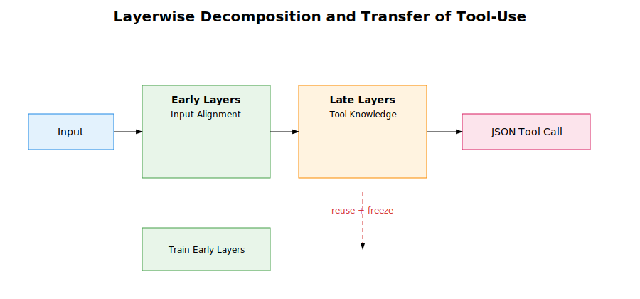
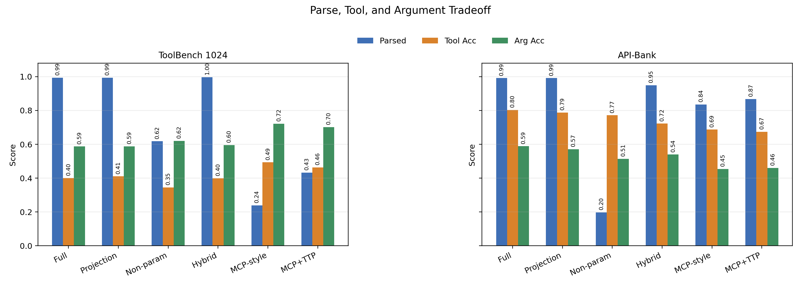
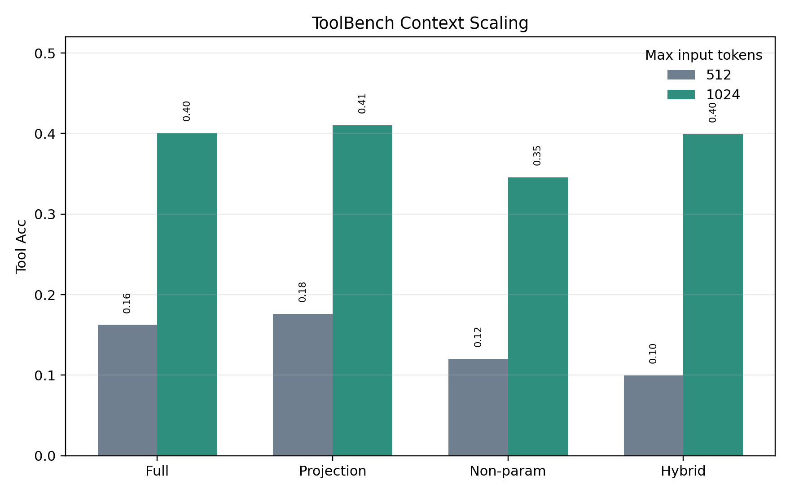
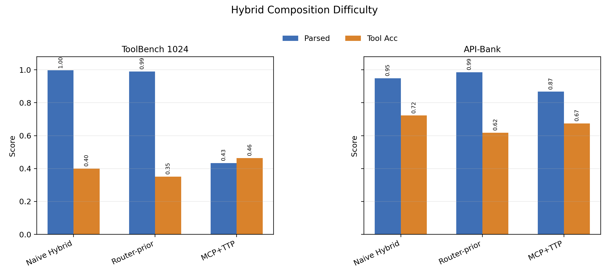

# Transferable Tool-Use Adapter

This repository studies whether **tool-use capability in LLMs can be modularized and transferred**.

We propose a **layerwise decomposition of LoRA adapters** into:

- Early layers → input alignment  
- Late layers → tool-use knowledge  

and demonstrate that:

> Tool knowledge can be **reused and transferred** by freezing late-layer adapters.

---

## Key Idea

We decompose tool-use into two components:

Input → Early Layers → Late Layers → JSON Tool Call

- Early layers adapt to input distribution  
- Late layers encode tool semantics and structured output  

---

## Method Overview



---

## Main Contributions

1. Layerwise decomposition of tool-use  
2. Transfer via adapter reuse (freeze late layers)  
3. Empirical evidence that:
   - Tool selection is preserved  
   - JSON structure is stable  
   - Transfer matches or exceeds full retraining  

---

## Project Structure

transferable-tool-adapter/

- src/  
  - train_source.py  
  - train_transfer.py  
  - eval_ood.py  

- data/  
- adapters/        (ignored) trained LoRA adapters  
- outputs/         (ignored) training outputs  
- results/         evaluation results  

- pyproject.toml  
- uv.lock  
- README.md  

---

## Environment Setup (uv)

Install dependencies:

uv sync

Verify CUDA:

uv run python -c "import torch; print(torch.cuda.is_available())"

---

## Experiments

### Step 1 — Train Source Adapter

uv run python src/train_source.py

Output:

adapters/adapter_source_full

---

### Step 2 — Transfer Training

#### Transfer (freeze late layers)

uv run python src/train_transfer.py --mode transfer

#### Full Target Training (baseline)

uv run python src/train_transfer.py --mode full

---

### Step 3 — OOD Evaluation

uv run python src/eval_ood.py --adapter adapters/adapter_target_transfer --save results/transfer.json

---

## Current Results

Metrics are reported on parsed outputs, so `Parsed` should be read together with `Tool Acc` and `Arg Acc`.

### ToolBench 1024

| Method | Parsed | Tool Acc | Arg Acc |
| --- | ---: | ---: | ---: |
| Qwen Full | 0.9936 | 0.4006 | 0.5870 |
| Qwen Projection A-linear | 0.9936 | 0.4103 | 0.5885 |
| Qwen Non-param | 0.6178 | 0.3454 | 0.6206 |
| Qwen Hybrid A-linear | 0.9968 | 0.3994 | 0.5954 |

### API-Bank

| Method | Parsed | Tool Acc | Arg Acc |
| --- | ---: | ---: | ---: |
| Tiny Source | 0.9807 | 0.8035 | 0.5566 |
| Qwen Non-param | 0.1970 | 0.7717 | 0.5145 |
| Qwen Full | 0.9914 | 0.8035 | 0.5886 |
| Qwen Projection A-linear | 0.9914 | 0.7883 | 0.5707 |
| Qwen Hybrid A-linear | 0.9486 | 0.7223 | 0.5393 |

## Figures

Generate the paper-facing plots from `results/merged/summary.csv`:

```powershell
uv --cache-dir .uv-cache run python src/plot_results.py
```

- `figures/toolbench_api_tradeoff.png`: compares parametric, non-parametric, hybrid, and MCP-style methods.
- `figures/context_scaling.png`: shows the effect of ToolBench context length.
- `figures/hybrid_composition.png`: summarizes hybrid composition difficulty.







---

## Observations

- Projection A-linear is the strongest transferable prior on ToolBench 1024.
- API-Bank projection approaches full target training while improving structural reliability over prompt-only tool use.
- Non-parametric prompting can have strong conditional accuracy, but parse rate is much lower under strict JSON evaluation.
- Naive hybrid composition improves structure in some settings but can introduce prior-schema interference.

---

## Analysis

We observe clear layer specialization:

- Early layers → input alignment  
- Late layers → tool knowledge  

This explains why freezing late layers still works.

---

## Transfer Mechanism

Source Model  
↓  
Late-layer LoRA (tool knowledge)  
↓ copy  
Target Model  
↓ freeze  
Train Early Layers  

---

## Notes

- Adapters and outputs are **not included** (see `.gitignore`)  
- Results are provided in `results/`  
- All experiments are reproducible via `uv`  

---

## Future Work

- Cross-model transfer (TinyLlama → Qwen)  
- Adapter projection across architectures  
- Multi-tool and real API tasks  

---

## License

MIT (or your choice)

---

## TODO (Research Backlog)

> Ongoing experiments and future directions.

### Experiments

- [ ] Split ratio ablation (vary early/late boundary)
- [ ] Multi-tool extension (more tools, more schemas)
- [ ] Prompt robustness (template / phrasing variation)
- [ ] Cross-model transfer (e.g., TinyLlama → other LLMs)

### Analysis

- [ ] Error breakdown (tool vs argument vs format)
- [ ] Layer-wise behavior analysis

### Figures

- [ ] Figure: Method overview (clean version)
- [ ] Figure: Source vs Transfer vs Full comparison
- [ ] Figure: Layer-wise ablation (split ratio)
- [ ] Figure: Error analysis
- [ ] Figure: Cross-model transfer (future)
- [x] Figure: ToolBench/API parse-tool-arg tradeoff
- [x] Figure: ToolBench context scaling
- [x] Figure: Hybrid composition difficulty
